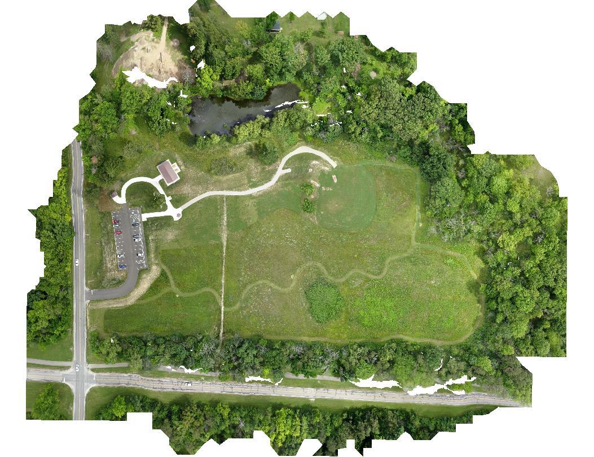

# Awesome Aerial Mapping

# Summary

This Github Repository is a part of the [ODM Organization](https://www.opendronemap.org/) and is aimed at being a repository which people can go to, to find material which can be used to learn more about ODM and Aerial Mapping. 

